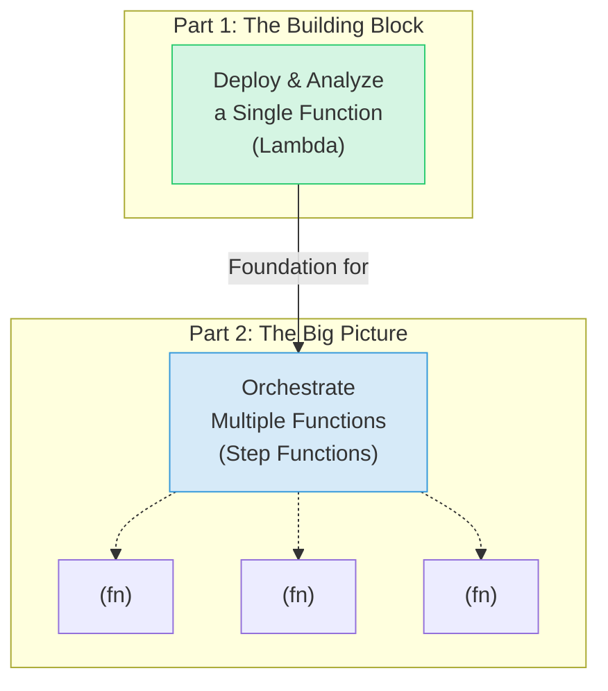
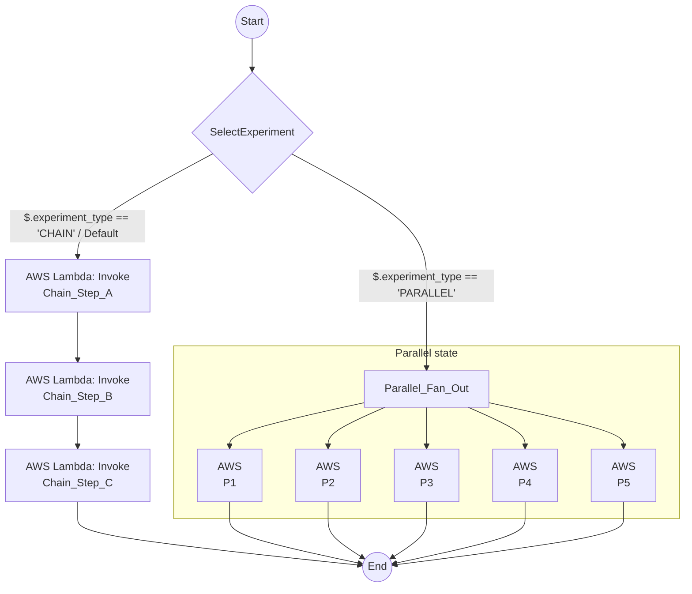
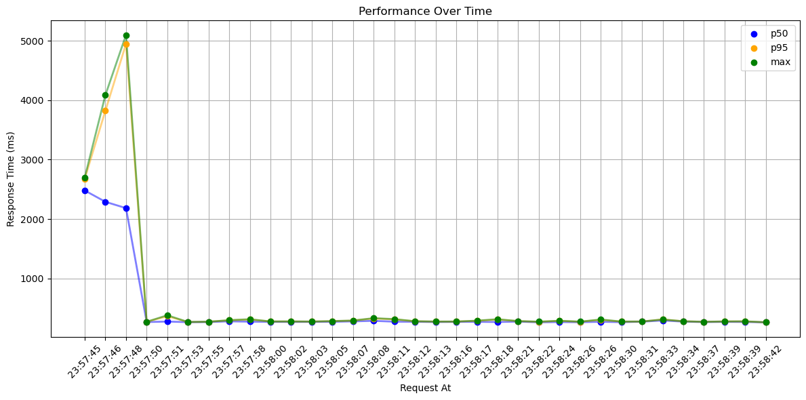
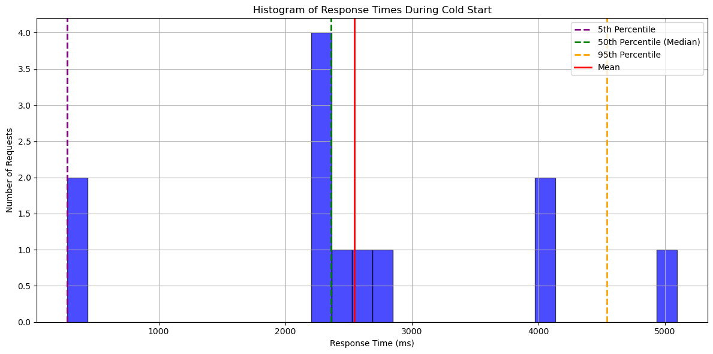
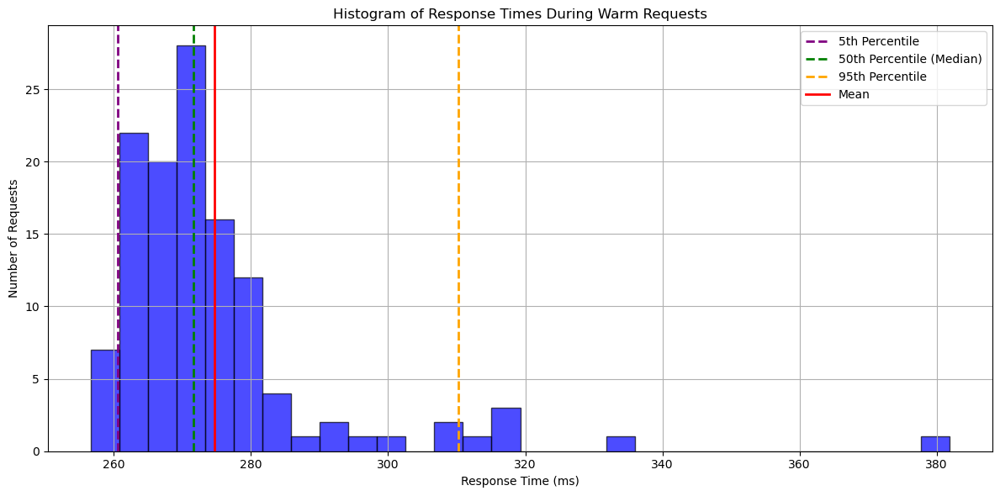
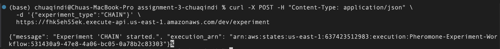
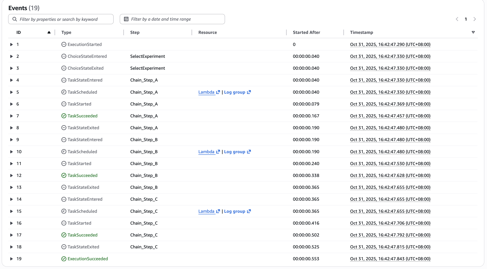
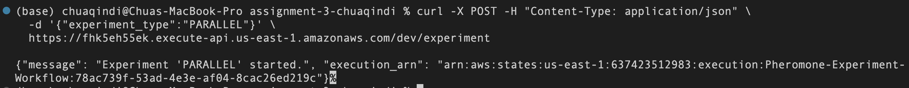

# CSC4160 Assignment 3: Model Serving & Serverless Orchestration Analysis (Total 8 points)

### Deadline: November 5, 2025, 23:59

### Name: Chua Qin Di

### Student ID: 125400010

---

# Assignment Overview

This assignment is a journey into the world of serverless computing, designed for beginners. We'll start with the basics in Part 1 and then build on them in Part 2 to see the bigger picture.

<div align="center">



</div>

- **Part 1: Your First Serverless Function**
  In Part 1, you'll learn how to take a piece of code, package it up, and run it in the cloud as a single, independent "serverless function." Think of this as learning to make one LEGO brick.
- **Part 2: Connecting Functions into a Workflow**
  In Part 2, you'll learn how to connect those LEGO bricks to build something bigger. We'll use a tool called a "workflow orchestrator" to make multiple functions work together, and we'll investigate the hidden performance costs of doing so.

---

# Part 1: Model Serving with AWS Lambda and Cold Start Performance Analysis (5 points)

## Overview (Part 1)

Welcome to Part 1! The goal here is to take a pre-trained machine learning model and turn it into a live API that anyone can use. To do this, we'll use a few key AWS services. You'll package the code using **Docker** (which creates a self-contained 'box' for your app), store that box in **ECR** (a cloud storage service for Docker images), and run it on **AWS Lambda** (which runs your code without you managing any servers). Finally, you'll use **API Gateway** to give your function a public URL. We'll also investigate a common serverless quirk called a 'cold start'—what happens when your function has to wake up from a nap.

We will use the well-known IRIS dataset to keep the machine learning model simple and focused on the serverless deployment process. The dataset includes four features: sepal length, sepal width, petal length, and petal width, and classifies samples into three categories: Iris Setosa, Iris Versicolour, and Iris Virginica.


### Components

1.  **Lambda Function Development**
    - Implement the `lambda_handler` function.
2.  **Environment Setup**
    - Set up your local development environment.
3.  **Docker Image Creation**
    - Make a Docker Image that will generate prediction using a trained model.
4.  **ECR Repository Setup**
    - Create an AWS ECR repository and push your Docker image to AWS ECR.
5.  **Lambda Function Creation in AWS Console**
    - Create a Lambda function using the container image.
6.  **API Gateway Configuration**
    - Using the API gateway to access the prediction API.
7.  **Load Testing and Analysis (Part 1)**
    - Use Locust to perform load testing on your deployed API.
    - Plot the results to observe the cold start trend.
    - Analyze the differences between cold start and warm request response times.

## Instructions (Part 1)

### 1. Lambda Function Development

You will be provided with the `predict` function and the model file; your task is to implement the `lambda_handler` function.

The lambda_handler function performs the following tasks:

- Extracts the `values`: It retrieves the values input from the incoming event, which are the features used for making predictions.
- Calls the predict function: It invokes the predict function, passing the extracted values to generate predictions based on the machine learning model.
- Return the prediction result: Finally, it formats the prediction results as a JSON response and returns them to the caller.

<details>
  <summary>Steps to Implement <code>lambda_handler</code></summary>

#### Extract Input from Event:

- You will receive the input features inside the `body` of the event.
- Parse this `body` as JSON and retrieve the `values`.
- You could also handle any possible errors, like missing input or invalid JSON.

#### Call the `predict` Function:

- After extracting the `values`, pass them to the `predict` function, which will return a list of predictions.

#### Format and Return the Response:

- Return the predictions as a JSON response.
</details>

<details>
  <summary>Testing the function</summary>

#### Test with Mock Input:

You can simulate the input to the `lambda_handler` via the AWS Lambda console. For example, an event might look like this:

```bash
{
  "body": "{\"values\": [[5.1, 3.5, 1.4, 0.2]]}"
}
```

#### Simulate predict:

If you want to test without uploading the model, you can temporarily simulate the predict function to return a mock result.

#### Test in AWS Lambda:

Use the AWS Lambda Console to test your function with a sample event, or you can set up API Gateway and send a request from there.

</details>

### 2. Environment Setup

Set up your local development environment on your machine:

- Install Docker Desktop for your operating system: https://www.docker.com/

- Install the AWS CLI: https://docs.aws.amazon.com/cli/latest/userguide/getting-started-install.html

- Ensure you have Python 3 and pip installed.

- (Optional but Recommended) Install Git: https://git-scm.com/downloads

- Configure your AWS credentials:

   <details>
   <summary>AWS credentials configuration</summary>

  #### To configure your AWS credentials, follow these steps:

  1.  **Access your AWS credentials**: On the Vocareum main page, navigate to "Account details" then "AWS CLI." Copy the provided Access Key ID, Secret Access Key, and Session Token.

  2.  **Create or open the credentials file**: Locate your AWS credentials file:

      - **macOS**: `~/.aws/credentials`
      - **Windows**: `C:\Users\%UserProfile%\.aws\credentials`

      If the file doesn't exist, create it using a plain text editor.

  3.  **Add your credentials**: Paste the Access Key ID, Secret Access Key, and Session Token into the file, using the following format. Add the `region` line (you can use any region, e.g., `us-east-1`):

      ```ini
      [default]
      region=us-east-1  # Add this line.
      aws_access_key_id=YOUR_ACCESS_KEY_ID
      aws_secret_access_key=YOUR_SECRET_ACCESS_KEY
      aws_session_token=YOUR_SESSION_TOKEN
      ```

      Replace `YOUR_ACCESS_KEY_ID`, `YOUR_SECRET_ACCESS_KEY`, and `YOUR_SESSION_TOKEN` with the values you copied from Vocareum.

  4.  **Save the file**: Ensure the file is saved, and only you have access to it.

  5.  **Important Security Note**: Never share your AWS credentials. Treat them like passwords. Do not commit this file to version control (e.g., Git). Add `.aws/credentials` to your `.gitignore` file. Consider using a more secure method of managing credentials in production environments.

   </details>

### 3. Docker Image Creation

Before building the Docker image, ensure the Docker daemon is running (start Docker Desktop on Windows/macOS or use `sudo systemctl start docker` on Linux).

In your local machine:

- Use the provided Dockerfile to create a Docker image:

  ```bash
  docker build -t iris_image .
  ```

- Run the Docker container locally:

  ```bash
  docker run -it --rm -p 8080:8080 iris_image:latest
  ```

  Here, we are mapping port 8080.

- Verify if the image is functioning properly by executing `test.py`.

### 4. ECR Repository Setup

Begin by launching your AWS Academy Learner Lab and ensuring your AWS credentials are correctly configured. Then, on your local computer, proceed with the following steps.

- Create an ECR repository:

  ```bash
  aws ecr create-repository --repository-name iris-registry
  ```

- Authenticate your Docker client with ECR:

  ```bash
  aws ecr get-login-password --region us-east-1 | docker login --username AWS --password-stdin <aws_account_id>.dkr.ecr.us-east-1.amazonaws.com
  ```

- Get image id:

  ```bash
  docker image ls
  ```

- Tag and push your Docker image:

  ```bash
  docker tag <image_id> <aws_account_id>.dkr.ecr.us-east-1.amazonaws.com/iris-registry:latest

  docker push <aws_account_id>.dkr.ecr.us-east-1.amazonaws.com/iris-registry:latest
  ```

### 5. Lambda Function Creation (Model Serving Lambda)

- In AWS console, create the Lambda function using the existing container image you have built and select `LabRole` as the execution role.
  **Note:** This Lambda function (e.g., named `iris-model-lambda`) is the core of Part 1.

### 6. API Gateway Configuration (for Model Serving API)

- Create an REST API for your Lambda function using API Gateway via AWS console.
  **Note:** This API Gateway is the entry point for Part 1.

- Test your API in your local machine using `curl` (Linux):

  ```bash
  curl --header "Content-Type: application/json" --request POST --data "{\"values\": [[<value1>, <value2>, <value3>, <value4>]]}" https://<your_api_id>.execute-api.<region>.amazonaws.com/default/<your_lambda_function>
  ```

  or using `Invoke-WebRequest` (Windows):

  ```bash
  Invoke-WebRequest -Method Post -Uri "https://<your_api_id>.execute-api.<region>.amazonaws.com/default/<your_lambda_function>" `
   -Headers @{ "Content-Type" = "application/json" } `
   -Body '{"values": [[<value1>, <value2>, <value3>, <value4>]]}'
  ```

### 7. Load Testing and Analysis

#### Load Testing

In your local machine, use the provided Locust load test script to evaluate the performance of your deployed API.

- Install Locust

```bash
pip install locust
```

- Navigate to the directory containing `locustfile.py`.
- Run the Locust test using:

```bash
locust -f locustfile.py --host https://<your_api_gateway_id>.execute-api.us-east-1.amazonaws.com --users 10 --spawn-rate 5 --run-time 60s --csv "locust_logs/test" --csv-full-history --html "locust_logs/test_locust_report.html" --logfile "locust_logs/test_locust_logs.txt" --headless
```

For Windows users, set the PATH for `locust`, or directly use the `locust.exe`, specifying its path, e.g.:

```bash
c:\users\user\appdata\roaming\python\python39\scripts\locust.exe -f locustfile.py --host https://<your_api_gateway_id>.execute-api.us-east-1.amazonaws.com --users 10 --spawn-rate 5 --run-time 60s --csv "locust_logs/test" --csv-full-history --html "locust_logs/test_locust_report.html" --logfile "locust_logs/test_locust_logs.txt" --headless
```

#### Analysis

Analyze the results using the performance analysis notebook on Google Colab. Upload your logs and run the notebook `performance_analysis.ipynb`. Fill in the estimated cold start time (in `<FILL IN>`) before graphing the histogram to compare response times during cold start and warm requests.

You will receive 1 point for including the required figures in your `.ipynb`: a line graph, a histogram of cold starts, and a histogram of warm requests.

---

# Part 2: Advanced Task - Measuring Step Function Orchestration Overhead (3 points)

## Overview (Part 2)

In Part 1, you built a single, powerful serverless function. But most real-world applications require multiple functions to work together in a sequence or in parallel. This is where an 'orchestrator' like **AWS Step Functions** comes in—it acts like a conductor, telling your functions when to run and what to do.

However, this coordination isn't free; it takes a small amount of time. The goal of this part is to become a performance detective. You will build a simple workflow and use 'probe' functions to measure this hidden 'coordination overhead'—the time the conductor spends directing the orchestra, as opposed to the time the orchestra spends playing music. This will give you a deeper understanding of how serverless systems perform in the real world.

**Experimental Architecture (Part 2):**



### Components

1.  **`sfn-probe-lambda`**: A new, lightweight Python Lambda function acting as a "probe" to record timestamps when invoked by SFN.
2.  **`Pheromone-Experiment-Workflow`**: A new Step Function (Standard workflow) containing two experimental paths (CHAIN and PARALLEL) controlled by input.
3.  **`sfn-trigger-lambda`**: A new, lightweight Python Lambda function triggered by API Gateway, responsible for starting the Step Function execution.
4.  **API Gateway (for Trigger)**: A new, simple REST API endpoint to trigger the `sfn-trigger-lambda`.

## Instructions (Part 2)

### 1. Create "Probe" Lambda (`sfn-probe-lambda`)

- Navigate to the **Lambda** service.
- Click "**Create function**".
- Select "**Author from scratch**".
- **Function name**: `sfn-probe-lambda`
- **Runtime**: `Python 3.10` (or similar).
- **Architecture**: `x86_64` (or match Part 1).
- **Permissions**: Use existing role `LabRole`.
- Click "**Create function**".
- In the **Code source** editor, paste the following Python code:

  ```python
  import json
  import time

  def lambda_handler(event, context):
      invoke_time = time.time()
      last_time = event.get('last_step_time', None)
      print(json.dumps({
          "message": f"Probe {event.get('step_name', 'Unknown')} invoked",
          "invoke_time": invoke_time,
          "last_step_time": last_time
      }))
      output = {
          "step_name": event.get('step_name', 'Unknown'),
          "last_step_time": invoke_time
      }
      return output
  ```

- Click "**Deploy**".
- **Copy** and **save** the function's **ARN**.

### 2. Create "Experiment" Step Function (`Pheromone-Experiment-Workflow`)

- Navigate to the **Step Functions** service.
- Click "**Create state machine**".
- Select "**Write your workflow in code**".
- **Type**: Select **Standard**.
- In the **Definition** editor, paste the following JSON.
- **IMPORTANT**: Replace **ALL 8** occurrences of `REPLACE_ME_WITH_PROBE_LAMBDA_ARN` with the ARN you copied in the previous step.
  ```json
  {
    "Comment": "Pheromone Overhead Analysis Workflow",
    "StartAt": "SelectExperiment",
    "States": {
      "SelectExperiment": {
        "Type": "Choice",
        "Choices": [
          {
            "Variable": "$.experiment_type",
            "StringEquals": "CHAIN",
            "Next": "Chain_Step_A"
          },
          {
            "Variable": "$.experiment_type",
            "StringEquals": "PARALLEL",
            "Next": "Parallel_Fan_Out"
          }
        ],
        "Default": "Chain_Step_A"
      },
      "comment_chain": "--- Experiment 1: Measure Serial Orchestration Overhead ---",
      "Chain_Step_A": {
        "Type": "Task",
        "Resource": "arn:aws:states:::lambda:invoke",
        "Parameters": {
          "FunctionName": "REPLACE_ME_WITH_PROBE_LAMBDA_ARN",
          "Payload": {
            "step_name": "A",
            "last_step_time.$": "$.last_step_time"
          }
        },
        "ResultPath": "$.lambda_output_A",
        "OutputPath": "$.lambda_output_A",
        "Next": "Chain_Step_B"
      },
      "Chain_Step_B": {
        "Type": "Task",
        "Resource": "arn:aws:states:::lambda:invoke",
        "Parameters": {
          "FunctionName": "REPLACE_ME_WITH_PROBE_LAMBDA_ARN",
          "Payload": {
            "step_name": "B",
            "last_step_time.$": "$.Payload.last_step_time"
          }
        },
        "ResultPath": "$.lambda_output_B",
        "OutputPath": "$.lambda_output_B",
        "Next": "Chain_Step_C"
      },
      "Chain_Step_C": {
        "Type": "Task",
        "Resource": "arn:aws:states:::lambda:invoke",
        "Parameters": {
          "FunctionName": "REPLACE_ME_WITH_PROBE_LAMBDA_ARN",
          "Payload": {
            "step_name": "C",
            "last_step_time.$": "$.Payload.last_step_time"
          }
        },
        "ResultPath": null,
        "End": true
      },
      "comment_parallel": "--- Experiment 2: Measure Parallel Orchestration Overhead ---",
      "Parallel_Fan_Out": {
        "Type": "Parallel",
        "Branches": [
          {
            "StartAt": "P1",
            "States": {
              "P1": {
                "Type": "Task",
                "Resource": "arn:aws:states:::lambda:invoke",
                "Parameters": {
                  "FunctionName": "REPLACE_ME_WITH_PROBE_LAMBDA_ARN",
                  "Payload": { "step_name": "P1" }
                },
                "ResultPath": null,
                "End": true
              }
            }
          },
          {
            "StartAt": "P2",
            "States": {
              "P2": {
                "Type": "Task",
                "Resource": "arn:aws:states:::lambda:invoke",
                "Parameters": {
                  "FunctionName": "REPLACE_ME_WITH_PROBE_LAMBDA_ARN",
                  "Payload": { "step_name": "P2" }
                },
                "ResultPath": null,
                "End": true
              }
            }
          },
          {
            "StartAt": "P3",
            "States": {
              "P3": {
                "Type": "Task",
                "Resource": "arn:aws:states:::lambda:invoke",
                "Parameters": {
                  "FunctionName": "REPLACE_ME_WITH_PROBE_LAMBDA_ARN",
                  "Payload": { "step_name": "P3" }
                },
                "ResultPath": null,
                "End": true
              }
            }
          },
          {
            "StartAt": "P4",
            "States": {
              "P4": {
                "Type": "Task",
                "Resource": "arn:aws:states:::lambda:invoke",
                "Parameters": {
                  "FunctionName": "REPLACE_ME_WITH_PROBE_LAMBDA_ARN",
                  "Payload": { "step_name": "P4" }
                },
                "ResultPath": null,
                "End": true
              }
            }
          },
          {
            "StartAt": "P5",
            "States": {
              "P5": {
                "Type": "Task",
                "Resource": "arn:aws:states:::lambda:invoke",
                "Parameters": {
                  "FunctionName": "REPLACE_ME_WITH_PROBE_LAMBDA_ARN",
                  "Payload": { "step_name": "P5" }
                },
                "ResultPath": null,
                "End": true
              }
            }
          }
        ],
        "ResultPath": null,
        "End": true
      }
    }
  }
  ```
- Click the refresh icon to check the graph.
- Click "**Next**".
- **Name**: `Pheromone-Experiment-Workflow`
- **Permissions**: Choose "**Choose an existing role**" and select `LabRole`.
- Click "**Create state machine**".
- **Copy** and **save** the state machine's **ARN**.

### 3. Create "Trigger" Lambda (`sfn-trigger-lambda`)

- Navigate back to the **Lambda** service.
- Click "**Create function**", "**Author from scratch**".
- **Function name**: `sfn-trigger-lambda`
- **Runtime**: `Python 3.10` (or similar).
- **Permissions**: Use existing role `LabRole`.
- Click "**Create function**".
- In the **Code source** editor, paste the following Python code:

  ```python
  import json
  import boto3
  import os
  import time

  # ↓↓↓ Replace this line with the SFN ARN from Step 2 ↓↓↓
  STATE_MACHINE_ARN = 'ARN_OF_Pheromone-Experiment-Workflow_HERE'
  # ↑↑↑ Replace this line with the SFN ARN from Step 2 ↑↑↑

  sfn_client = boto3.client('stepfunctions')

  def lambda_handler(event, context):
      try:
          body = json.loads(event.get('body', '{}'))
          exp_type = body.get('experiment_type', 'CHAIN')
          sfn_input = {
              'experiment_type': exp_type,
              'last_step_time': time.time()
          }
          response = sfn_client.start_execution(
              stateMachineArn=STATE_MACHINE_ARN,
              input=json.dumps(sfn_input)
          )
          return {
              'statusCode': 202,
              'body': json.dumps({
                  'message': f"Experiment '{exp_type}' started.",
                  'execution_arn': response['executionArn']
              })
          }
      except Exception as e:
          print(f"Error starting Step Function: {e}")
          return {'statusCode': 500, 'body': f"Internal server error: {str(e)}"}
  ```

- **IMPORTANT**: Replace `ARN_OF_Pheromone-Experiment-Workflow_HERE` with the SFN ARN you copied in Step 2.
- Click "**Deploy**".

### 4. Create API Gateway (for Trigger)

- Navigate to the **API Gateway** service.
- Click "**Create API**", find **REST API**, click "**Build**".
- **API name**: `SFN Experiment Trigger`
- **Endpoint Type**: Select **Regional**.
- Click "**Create API**".
- Actions menu -\> "**Create Resource**". Name/Path: `experiment`. Click "**Create Resource**".
- Select `/experiment`, Actions menu -\> "**Create Method**". Choose **POST**, click the checkmark ✔️.
- Setup:
  - **Integration type**: Lambda Function
  - **Check** "Use Lambda Proxy integration"
  - **Lambda Function**: `sfn-trigger-lambda`
  - Click "**Save**" (OK).
- Actions menu -\> "**Deploy API**".
  - Deployment stage: `[New Stage]`
  - Stage name: `dev`
  - Click "**Deploy**".
- **Copy** and **save** the **Invoke URL**.

### 5. Run Experiments

- Open your local terminal.
- **Run CHAIN experiment**:
  ```bash
  curl -X POST -H "Content-Type: application/json" -d '{"experiment_type": "CHAIN"}' <YOUR_API_GATEWAY_URL>/experiment
  ```
  _(Replace `<YOUR_API_GATEWAY_URL>`)_
- **Run PARALLEL experiment**:
  ```bash
  curl -X POST -H "Content-Type: application/json" -d '{"experiment_type": "PARALLEL"}' <YOUR_API_GATEWAY_URL>/experiment
  ```
  _(Replace `<YOUR_API_GATEWAY_URL>`)_
- Record the `execution_arn` returned for both experiments.

### 6. Analyze Step Function Overhead

- Go to the **Step Functions** console, find `Pheromone-Experiment-Workflow`.
- **Analyze CHAIN Execution**:
  - Find the execution corresponding to your CHAIN experiment ARN.
  - Go to the **Events** tab.
  - Find timestamps for:
    - T_A_end (`TaskSucceeded` for step A)
    - T_B_start (`TaskStateEntered` for step B)
    - T_B_end (`TaskSucceeded` for step B)
    - T_C_start (`TaskStateEntered` for step C)
  - Calculate `Overhead_AB = T_B_start - T_A_end` (in milliseconds).
  - Calculate `Overhead_BC = T_C_start - T_B_end` (in milliseconds).
- **Analyze PARALLEL Execution**:
  - Find the execution corresponding to your PARALLEL experiment ARN.
  - Go to the **Events** tab.
  - Find timestamps for:
    - T_parallel_start (`ParallelStateEntered`)
    - T_last_started (The timestamp of the **last** `TaskStarted` event among P1-P5).
  - Calculate `Fan-out_Delay = T_last_started - T_parallel_start` (in milliseconds).

---

## Questions (Part 1)

### Understanding AWS Lambda and API Gateway

- **AWS Lambda Function** (0.5 point):
  What is the role of a Lambda function in serverless deployment? How does the `lambda_handler` function work to process requests? <br>

  > <span style="color:white"> **Answer**: <Your answer goes here> An AWS Lambda function is the compute unit in a serverless deployment. The lambda_handler function is the designated entry point, automatically invoked when an event occurs. It receives the input event and context, executes the application logic, and returns a response. In this deployment, the handler extracts the input features, applies the prediction model, and outputs the classification result, while AWS manages the runtime and scaling transparently.

- **API Gateway and Lambda Integration** (0.5 point):
  Explain the purpose of API Gateway in this deployment process. How does it route requests to the Lambda function?
  <br>

  > <span style="color:white"> **Answer**: <Your answer goes here> API Gateway serves as the HTTP interface for serverless applications. It exposes a REST endpoint that end users can call, forwards requests as event objects to the associated Lambda function, and then converts the Lambda’s output into a structured HTTP response. This integration allows clients users to interact with the prediction service through a secure and scalable public API.

### Analysis of Cold Start Phenomenon





- **Cold Start Versus Warm Requests** (1 point):
  Provide your analysis comparing the performance of requests during cold starts versus warm requests (based on the line graph and histograms you obtained in `performance_analysis.ipynb`). Discuss the differences in response times and any notable patterns observed during your load testing. <br>

  > <span style="color:white"> **Answer**: <Your answer goes here> Performance measurements demonstrate a significant difference between cold and warm invocations. During the cold start phase (23:57:45–23:57:49), response times were highly variable, with median latencies in the 2–3 s range and the 95th percentile approaching 4–5 s. After initialization, response times stabilized between 200–300 ms with low variance across percentiles. The data confirms that latency overhead is concentrated in the cold start period, while subsequent requests achieve consistently low latency.

- **Implications and Strategies** (0.5 point):
  Discuss the implications of cold starts on serverless applications and how they affect performance. What strategies can be employed to mitigate these effects? <br>

  > <span style="color:white"> **Answer**: <br> <Your answer goes here> Cold starts introduce unpredictable delays that can affect latency-sensitive applications. Mitigation strategies include enabling provisioned concurrency, sending periodic warm-up requests to keep functions active, minimizing package size and dependencies, and selecting runtimes with shorter initialization times. These approaches reduce the frequency and impact of cold starts, leading to more consistent performance.

---

## Questions (Part 2)

### Analysis of Step Function Orchestration Overhead

For this section, first complete the two data collection tables based on your experiments. Then, answer the analysis questions that follow.

**1. Chain Experiment Analysis (0.5 point)**

Fill in the table with data from your CHAIN experiment execution. All times should be in milliseconds (ms).

| Metric / Event                     | Value        | Notes                                                                      |
| ---------------------------------- | ------------ | -------------------------------------------------------------------------- |
| `T_A_start` (raw)                  | 16:42:47.330 | Timestamp of `TaskStateEntered` for A                                      |
| `T_A_end` (raw)                    | 16:42:47.457 | Timestamp of `TaskSucceeded` for A                                         |
| `T_B_start` (raw)                  | 16:42:47.480 | Timestamp of `TaskStateEntered` for B                                      |
| `T_B_end` (raw)                    | 16:42:47.628 | Timestamp of `TaskSucceeded` for B                                         |
| `T_C_start` (raw)                  | 16:42:47.655 | Timestamp of `TaskStateEntered` for C                                      |
| `T_C_exit` (raw)                   | 16:42:47.815 | Timestamp of `TaskStateExited` for C                                       |
| `Overhead_AB`                      | 23 ms        | `= T_B_start - T_A_end`                                                    |
| `Overhead_BC`                      | 27 ms        | `= T_C_start - T_B_end`                                                    |
| **Total Orchestration Overhead**   | 50 ms        | `= Overhead_AB + Overhead_BC`                                              |
| **Total Internal Processing Time** | 485 ms       | `=T_C_exit - T_A_start`                                                    |
| **Overhead Percentage (%)**        | 10.3 %       | `= (Total Orchestration Overhead / Total Internal Processing Time) * 100%` |

**2. Parallel Experiment Analysis (0.5 point)**

Fill in the table with data from your PARALLEL experiment execution. All times should be in milliseconds (ms).

| Metric / Event                    | Value        | Notes                                                     |
| --------------------------------- | ------------ | --------------------------------------------------------- |
| `T_parallel_start` (raw)          | 16:47:17.512 | Timestamp of `ParallelStateEntered`                       |
| `T_last_started` (raw)            | 16:47:17.614 | Timestamp of the **last** `TaskStarted` event             |
| `T_last_started` (raw)            | 16:47:17.881 | Timestamp of the `ParallelStateExited` event              |
| **Fan-out Delay**                 | 102 ms       | `= T_last_started - T_parallel_start`                     |
| **Total Parallel State Duration** | 369 ms       | `= T_last_started - T_parallel_start`                     |
| **Overhead Percentage (%)**       | 27.6 %       | `= (Fan-out Delay / Total Parallel State Duration) * 100` |

## Chain Execution Event




## Parallel Execution Event




**3. Analysis Questions (1.5 points)**

**Data Interpretation (0.5 points)**

Based on your data tables, briefly summarize your key findings. What was the typical "thinking time" (overhead) between sequential tasks in your Chain experiment? How much of a delay (`Fan-out Delay`) did you observe in the Parallel experiment? <br>

> <span style="color:white">**Answer**: <Your answer here> The Chain experiment results indicate that the orchestration overhead between consecutive tasks is relatively small, with overhead timings of 23 ms (A -> B) and 27 ms (B -> C). These delays represent 10.3% of the total internal execution time (485ms), suggesting that sequential task orchestration introduces a small latency relative to computation. <br> <br>In contrast, the Parallel experiment resulted in a more significant orchestration cost. The fan-out delay, which is the time between the entry of the parallel state and the start of the last branch, was measured at 102 ms. This accounted for 27.6% of the total parallel state duration (369ms), indicating that parallel fan-out introduces proportionally higher ocheastration overhead due to concurrent scheduling and synchronization among multiple Lambdas.

**Connecting to Theory (1 point)**

In the paper, ["Following the Data, Not the Function: Rethinking Function Orchestration in Serverless Computing"](https://arxiv.org/pdf/2109.13492), the authors of Pheromone critique orchestration systems like AWS Step Functions, arguing that their _function-centric_ model introduces significant performance overhead. They state:

> _"Conventional function-centric platforms... treat functions as the primary unit of computation and composition. This approach forces the orchestrator to become a performance bottleneck, as it must serially mediate all function interactions, adding unnecessary latency, especially for workflows with fine-grained, short-running functions."_

Based on your experimental data, particularly the **Overhead Percentage (%)** you calculated for the **Chain experiment**:

1.  Explain how your results serve as a practical example of the problem described in the quote. Does your calculated overhead seem "unnecessary" or "significant" compared to the actual time your functions spent doing useful work? <br>

    > <span style="color:white"> **Answer**: The Chain experiment demonstrated an orchestration overhead of approximately 50 ms, or 10.3% of the total runtime. This delay resulted purely from Step Functions managing state transitions between Lambda tasks. This finding directly supports the critique in Pheromone: the function-centric orchestration model imposes nontrivial latency even for simple, sequential workflows. When functions are short-running, such mediation overhead becomes proportionally significant, reducing overall efficiency and highlighting the orchestrator as a systemic bottleneck. <Your answer here>

2.  Why is this overhead problem _especially_ bad for "fine-grained, short-running functions" like the ones you used in this experiment? <br>

    > <span style="color:white"> **Answer**:For fine-grained, short-running functions, orchestration overhead represents a disproportionately large fraction of total runtime. In this experiment, each Lambda executed in only a few hundred milliseconds, yet the Step Functions coordination delay reached tens of milliseconds, which is significant relative to the computation itself. Such fixed orchestration costs thus dominate the overall latency, making the system communication-bound rather than compute-bound. This validates the authors’ argument that function-centric orchestration severely penalizes fine-grained workflows, where the cost of coordination outweighs the actual useful work performed. <Your answer here>

---

## Submission Requirements

**Part 1 Submissions (5 points total):**

- **`README.md` (2.5 points)**: This file, with all questions from Part 1 answered.
- **`lambda_function.py` (0.5 point)**: Your completed Lambda handler code.
- **CloudWatch Log File (0.5 point)**: Export the CloudWatch log for a single invocation as a `.csv` file and place it in the `./results` folder as `part1_cloudwatch_log.csv`.
- **API Test Screenshot (0.5 point)**: A screenshot of a successful `curl` or `Invoke-WebRequest` call. Name the file `part1_api_test.png` and place it in the `./results` folder.
- **`performance_analysis.ipynb` (0.5 point)**: Your completed notebook, including the line graph, cold start histogram, and warm request histogram.
- **`test_locust_logs.txt` (0.5 point)**: The raw log file from your Locust test run, under `./locust_logs`.

**Part 2 Submissions (3 points total):**

- **`README.md` Answers & Data (2.5 points)**: Your complete answers to all questions in Part 2, including the fully filled-out data tables.
- **SFN Event Screenshots (0.5 points)**: Screenshots from the AWS console showing the event lists and timestamps you used for your data collection. Name the files `part2_sfn_events_chain.png` and `part2_sfn_events_parallel.png`, and place them in the `./results` folder.
